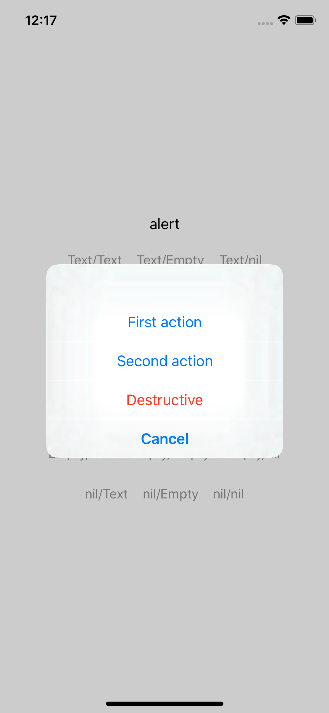

# AlertPattern

## UIAlertController.Style.alert

| | not empty message | empty message | nil message |
|:-:|:-:|:-:|:-:|
| not empty title ||||
| empty title ||||
| nil title ||||

## UIAlertController.Style.actionSheet

| | not empty message | empty message | nil message |
|:-:|:-:|:-:|:-:|
| not empty title ||||
| empty title ||||
| nil title ||||
